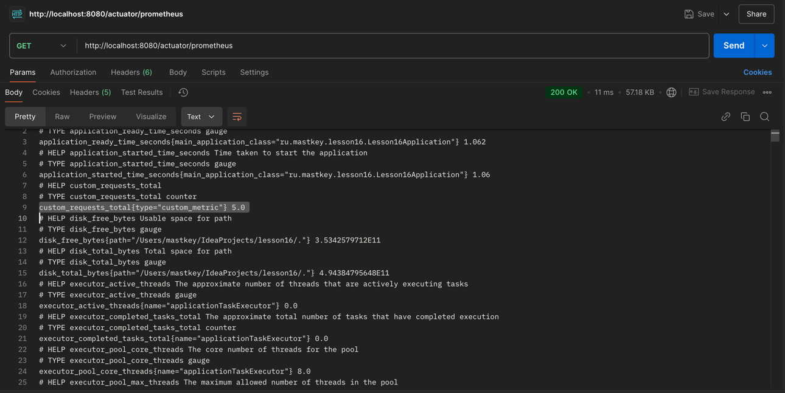

## 1. Поднять локально ELK через compose
- ### 1.1. Сделать скрины из kibana с логами:

- ### 1.2. Добавить структурный лог (прокидывать любое поле через MDC), приложить скрины:

- ### 1.3. Построить график с количеством запросов в Kibana, приложить скрины:

## 2. Подключить метрики к проекту
- ### 2.1. Подключить actuator. Показать скрин ответа .../actuator:

- ### 2.2. Подключить prometheus. Создать свою метрику. Приложить скрин ответа /prometheus с созданной метрикой:

## 3. Разобраться с работой с памятью
- ### 3.1. Привести пример кода для получения StackOverflow:

- ### 3.2. Привести пример кода для получения OutOfMemory:

